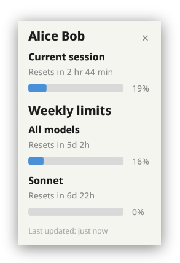

# Claude Usage Widget

Claude's usage page is buried in settings and requires you to open your browser every time you want to check how much of your plan you've used. This widget sits on your desktop and shows your current session and weekly usage at a glance — pulled from the same data shown at https://claude.ai/settings/usage — so you always know where you stand before hitting a rate limit.

Especially useful for heavy Claude Code users who burn through their allocation quickly and want to keep an eye on remaining capacity without breaking their workflow.

<p align="center">
  
</p>

## Prerequisites

- [Rust toolchain](https://rustup.rs/) (for building from source)
- Logged into claude.ai in a supported browser (Chrome, Brave, or Firefox)

The widget reads your session cookie to fetch usage data — no API key needed.

## Install

```
cargo install --git https://github.com/SmartAppsCo/claude-usage-widget.git --tag v0.3.0
```

This places the `claude-usage` binary in `~/.cargo/bin/` (make sure it's in your `PATH`).

## Options

```
--browser <firefox|chrome|brave>   Browser to read cookies from (auto-detected if omitted)
--data-dir <PATH>                  Custom browser data directory (requires --browser)
--title <NAME>                     Display name shown in the widget header
```

`--data-dir` is useful for non-standard browser installations or custom profiles where the cookie database isn't in the default location.

When `--title` is omitted, the widget fetches your name from the "What should Claude call you?" setting on your account. You can change this at https://claude.ai/settings/general. Passing `--title` skips that extra API call.

## Behavior

The widget polls usage data every 5 minutes by default. It pauses polling automatically when you're idle (no keyboard/mouse activity) to avoid unnecessary requests. Right-click the widget to adjust the refresh interval.

## Disclaimer

This project is not affiliated with, endorsed by, or associated with Anthropic, PBC. "Claude" and "Anthropic" are trademarks of Anthropic, PBC. All other trademarks are the property of their respective owners. This is an independent, unofficial tool.
